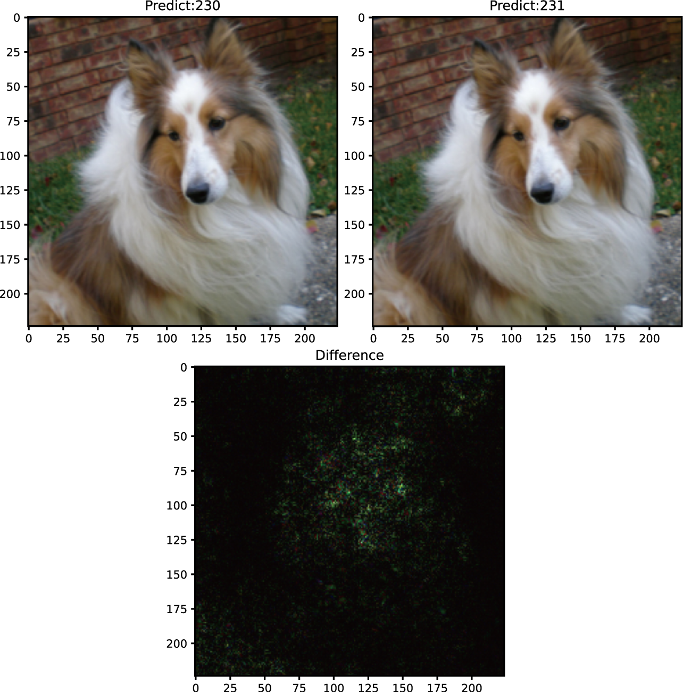

# PenaltyAttack
This repository contains:<br>
1). the implementation of our proposed white-box L1 and L2 adversarial attack based on penalty method;<br>
2). the code for reproducing our experiment;
3). our experimental results.<br>
 Below is an adversarial example generated by our method on ImageNet.
<p align="center">
    
</p>
<p align="center">
<b>Figure.</b>An L2 adversarial example generated on ImageNet by our attack. Upleft:original image,Upright:adversarial image, Bottom: perturbation.
</p>

Our experiment based on Python3.11. Steps for reproducing the presented experiment results. 
#### Requirements
- pytorch
- torchvision
- numpy
- matplotlib
- torchattacks https://github.com/Harry24k/adversarial-attacks-pytorch
- robustbench https://github.com/RobustBench/robustbench
- Adversarial-library https://github.com/jeromerony/adversarial-library

1).Results for MNIST in Table 3, Table 4 can be generated by running  ```python experiment_mnist_penalty_attack.py```.<br>
2).Results for CIFAR10 in Table 5, Table 6 can be generated by running  ```python experiment_cifar10_penalty_attack.py```.<br>
3).Results for ImageNet in Table 7, Table 8 can be generated by running  ```python experiment_imagenet_penalty_attack.py```.<br>
4).Running results will be stored in ```./result```.<br>
5).Some generated adversarial examples are in ```./GeneratedAE```<br>
6).```./torchattacks``` is the torchattacks package we modified for our experiments. <br>
7).```./plot_curve``` includes the code for plotting the figures of how ASR changes with respect to perturbation.<br> 

Only models for MNIST are in the repository. Models for CIFAR and ImageNet will be downloaded automatically by robustbench package. MNIST and CIFAR datasets will also be downloaded automatically and the images used for ImageNet(ILSVRC2012) are the first 1000 images in validation set. <br>


